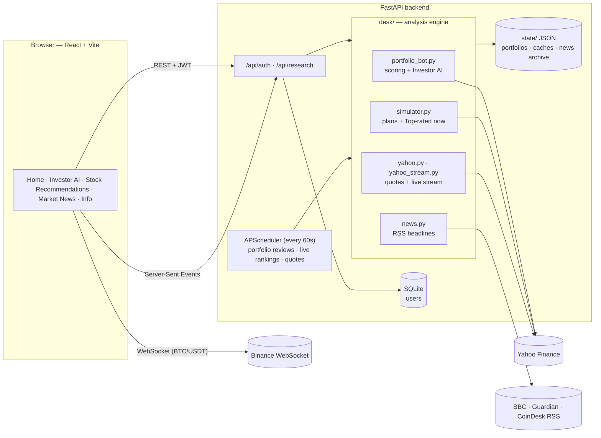

# InvestIQ

**Smarter investing decisions for first-time investors — powered by transparent AI analysis, real market data and personalized recommendations.**

Built by **Team 3/4ths Princess** for **HackRice 2026**.

> ⚠️ InvestIQ is an educational project. It provides analytical insights, not financial advice. Investor AI runs a **practice portfolio on live market prices and never places real orders**. Investing involves risk, and no result is guaranteed.

---

## Table of contents

1. [What InvestIQ does](#what-investiq-does)
2. [Features by tab](#features-by-tab)
3. [Tech stack](#tech-stack)
4. [Architecture](#architecture)
5. [How the AI makes decisions](#how-the-ai-makes-decisions)
6. [Data sources and APIs](#data-sources-and-apis)
7. [API reference](#api-reference)
8. [Getting started](#getting-started)
9. [Testing](#testing)
10. [Project structure](#project-structure)
11. [Performance, honestly](#performance-honestly)
12. [Limitations](#limitations)
13. [Roadmap: taking InvestIQ to real life](#roadmap-taking-investiq-to-real-life)
14. [Disclaimer](#disclaimer)

---

## What InvestIQ does

Most beginners don't know **what** to buy, **how much** to put in each investment, or **why** a trade makes sense. InvestIQ answers all three:

| Question | InvestIQ's answer |
|---|---|
| *What should I invest in?* | Scores 22 stocks, ETFs, bonds, gold and crypto using price trends, company finances and live news. |
| *How much in each?* | Builds a personalized split — exact percentages and dollar amounts that add up to 100% — based on your amount, risk level and timeline. |
| *Why?* | Every recommendation and every trade comes with a plain-English explanation. |

The experience is designed as a simple flow:

```
Home  →  Investor AI  →  Stock Recommendations  →  Market News
                     (Info is always available to explain how it all works)
```

---

## Features by tab

### 🏠 Home
- Short welcome and a **3-step guide** with buttons that take you straight to each feature.

### 🤖 Investor AI
An AI that manages a practice portfolio for you.
- **Three questions:** how much to invest ($100–$1,000,000), risk level (Low / Medium / High) and timeline (1–120 months).
- **Optional replay:** start as if the AI had been trading for the past 3 months — it re-runs hour by hour on real historical prices, with no access to future data, then continues live.
- **Current Activity:** portfolio value, total profit, available cash, AI status, a profit-over-time chart with trade markers, current holdings, and the latest trade.
- **History:** every trade with its profit/loss and a **"Why This Trade?"** explanation (market conditions, price movement, indicators, company data, volatility, news and risk factors).
- **Settings:** change amount, risk or timeline (with confirmation), start over, or replay.
- **Controls:** pause, resume or trigger a review now.
- Reviews the market **every 5 minutes, 24/7** — stocks and ETFs trade during US market hours (9:30am–4pm ET), crypto trades around the clock.

### 📊 Stock Recommendations
- **Personalized plan:** enter your own one-time and monthly amounts, or let InvestIQ **suggest a monthly amount** from your income and (optional) bills.
- **Your recommended stocks and ETFs:** allocation percentages, exact dollar amounts for the one-time and monthly contributions, risk level, role in the portfolio, and **View Detailed Analysis** for each pick.
- **Top-rated now (live):**
  - **Buy signals right now** for any risk level and number of months, with a **pie chart** of how to split your money.
  - A ranked list of every asset with score, price, 1-week / 1-month change, trend, risk level, **Buy / Watch / Avoid** signal, rank changes since the previous close, and a **"📰 News moved it up/down"** badge.
  - Latest headlines per stock with good / neutral / bad tone markers.
  - A **"Just in"** feed of new headlines and rank moves.
  - **Add to plan:** include up to 5 extra picks in your personalized plan.
  - Updates automatically — headlines are re-checked every minute in rotation and the page refreshes every 15 seconds.

### 📰 Market News
- Latest business, economy and crypto headlines, filterable by source and topic.
- **Live Bitcoin price** streamed from Binance.
- **Live watchlist** of stocks, ETFs, gold and crypto streamed from Yahoo Finance.

### ℹ️ Info
- How InvestIQ works, how the AI makes decisions, data sources, the risk limits for each level, understanding risk, a glossary and the disclaimer.

---

## Tech stack

### Frontend
| Technology | Purpose |
|---|---|
| **React 19** + **TypeScript 6** | UI components |
| **Vite 8** | Dev server and build; proxies `/api` to the backend |
| **React Router 6** | Navigation between tabs (`/?view=investor-ai`, `recommendations`, `news`, `info`) |
| **Axios** | API client — attaches JWT tokens and refreshes them automatically on `401` |
| **Recharts 3** | Profit chart, pie chart and projections |
| **lucide-react** | Icons |
| **Tailwind CSS 4** | Auth pages (the main app uses a custom dark theme in `research-desk.css`) |
| **react-hook-form** + **zod** | Login / registration form validation |
| **oxlint** | Linting |

### Backend
| Technology | Purpose |
|---|---|
| **Python 3.12** + **FastAPI** | REST API and Server-Sent Events |
| **Uvicorn** | ASGI server |
| **SQLAlchemy 2 (async)** + **SQLite** (`aiosqlite`) | User accounts (PostgreSQL-ready via `asyncpg`) |
| **Alembic** | Database migrations |
| **Pydantic 2** | Request validation |
| **python-jose (JWT)** + **passlib / bcrypt** | Authentication and password hashing |
| **APScheduler** | Background jobs every 60 seconds (portfolio reviews, live rankings, quotes) |
| **pandas** + **NumPy** | Returns, moving averages, RSI, volatility, allocation math |
| **yfinance** | Yahoo Finance prices, company data and news |
| **websockets** | Yahoo Finance live price stream |

### Storage
| Data | Where |
|---|---|
| Users | SQL database (`backend/dev.db` in development) |
| Each user's Investor AI portfolio | `state/accounts/<user-id>/portfolio.json` |
| Market data cache (prices, company data, news) | `state/portfolio-market/` |
| Headline archive (for long-term news memory) | `state/news-archive.json` |

---

## Architecture



### Request flow examples

**Starting Investor AI**
1. The user answers the three questions → `POST /api/research/portfolio/backfill` (or `/setup`).
2. `PortfolioBot` downloads prices, company data and news (cached), then replays each past trading hour: score → pick → size → trade → record explanation.
3. The portfolio is saved to `state/accounts/<user-id>/portfolio.json`.
4. From then on, the scheduler reviews it every 5 minutes; the page polls `GET /api/research/portfolio` every 30 seconds.

**Getting recommendations**
1. The user enters amounts, risk and months → `POST /api/research/simulator/plan`.
2. `build_plan()` scores every asset (with news weighted at 35%), chooses picks within the risk limits, and rounds to exact percentages and cents.
3. The **Top-rated now** panel calls `GET /api/research/simulator/leaderboard`, which is kept fresh by a background job while someone is watching.

---

## How the AI makes decisions

InvestIQ's AI is a **transparent, rule-based scoring system** — not a black-box model. Every number behind a decision can be shown to the user, which is what makes the "Why This Trade?" explanations possible.

### 1. Score every asset (0 to 1)

| Signal | What it measures |
|---|---|
| **Momentum** | How the asset's 1, 3, 6 and 12-month returns rank against the others |
| **Trend** | Whether the price is above its 20, 50 and 200-day moving averages |
| **RSI** | Whether it's overheated or oversold (best near a balanced level) |
| **Fundamentals** | Profit margin, revenue growth and price-to-earnings ratio |
| **Headline tone** | Recent headlines scored as good, neutral or bad |
| **Volatility penalty** | Bigger price swings reduce the score, more so at lower risk |

### 2. Weight signals by timeline

| Timeline | Months | Focus | Weights |
|---|---|---|---|
| Short-term | 1–3 | Recent momentum, not overheated | 1-mo momentum 35%, 3-mo 15%, trend 20%, RSI 20%, news 10% |
| Medium-term | 4–12 | Steady 3–6 month uptrends | 1-mo 10%, 3-mo 30%, 6-mo 20%, trend 20%, RSI 5%, fundamentals 10%, news 5% |
| Long-term | 13+ | Company finances and long trends | 3-mo 10%, 6-mo 20%, 12-mo 20%, trend 15%, fundamentals 30%, news 5% |

In **Stock Recommendations**, news is boosted to **35%** of the score and the other signals share the remaining 65%. Newer headlines count more: a headline's weight halves every **1 day** (short-term), **3 days** (medium-term) or **14 days** (long-term).

### 3. Skip anything that fails a check
An asset is blocked if it is too volatile for the chosen risk level, trades below its trend line, or scores under **0.45**.

### 4. Size positions within risk limits
Money is split in proportion to **score ÷ volatility** (or score alone at High risk), then capped:

| Rule | Low | Medium | High |
|---|---|---|---|
| Cash kept aside | 25% | 10% | 5% |
| Most in one investment | 20% | 25% | 35% |
| Most in company stocks | 20% | 50% | 85% |
| Most in one industry | 30% | 35% | 50% |
| Most in crypto | 0% | 10% | 20% |
| Sells after a loss of (stop loss) | 8% | 12% | 18% |
| Skips yearly volatility above | 30% | 50% | 90% |
| Investments held at most | 6 | 5 | 4 |

Recommendation plans also put at least **60%** (Low) or **35%** (Medium) into broad, diversified funds (whole-market, international and bond funds).

### 5. Trade realistically (Investor AI)
- **0.05% slippage** on every trade.
- Only trims or tops up when a holding drifts more than **0.75%** from its target, and gives current holdings a small bonus — this avoids constant in-and-out trading.
- Each trade stores a full explanation: market regime, price movement, indicators, company data, volatility, news and why that amount was chosen.

### 6. No look-ahead in replays
When replaying the past, the AI only sees data that existed at that moment: an hourly price bar is used only after that hour has finished, and crypto daily bars only after they close.

---

## Data sources and APIs

All sources are **free and need no API keys**.

| Source | Connection | Used for |
|---|---|---|
| **Yahoo Finance** via `yfinance` | Server-side, cached | Up to 10 years of daily prices, 60 days of hourly prices, company fundamentals, per-stock news |
| **Yahoo Finance streamer** (`wss://streamer.finance.yahoo.com`) | WebSocket on the server → **Server-Sent Events** to the browser | Live watchlist prices |
| **Binance** (`wss://data-stream.binance.vision`) | WebSocket directly from the browser | Live BTC/USDT price |
| **RSS feeds** — BBC News, The Guardian, CoinDesk (CNBC and Yahoo RSS are also configured) | Server-side, cached | Market headlines |
| **Google favicon service** | Image URL | Company logos |

**Caching:** prices refresh every ~2 minutes, hourly bars every 10 minutes, company data daily, and headlines are rotated (5 stocks per minute) while the recommendations page is open. Downloads that come back incomplete (for example during rate limiting) are rejected so the last good data is kept.

**Assets analyzed (22):**

| Type | Tickers |
|---|---|
| Broad and sector ETFs | SPY, QQQ, VTI, IWM, VXUS, XLV, XLF, XLE |
| Bonds | TLT, BND |
| Gold | GLD |
| Stocks | AAPL, MSFT, NVDA, AMZN, GOOGL, JPM, JNJ, KO, PG |
| Crypto (Investor AI only) | BTC-USD, ETH-USD |

---

## API reference

All paths are prefixed with `/api`. Everything except `/api/auth/*` requires `Authorization: Bearer <access_token>`. Interactive docs are available at **http://localhost:8000/docs** while the backend runs.

### Authentication
| Method | Path | Description |
|---|---|---|
| POST | `/api/auth/register` | Create an account |
| POST | `/api/auth/login` | Log in and receive access + refresh tokens |
| POST | `/api/auth/guest` | Start a guest demo account |
| POST | `/api/auth/refresh` | Get a new access token |
| GET | `/api/auth/me` | Current user |

### Investor AI
| Method | Path | Body | Description |
|---|---|---|---|
| GET | `/api/research/portfolio` | — | Portfolio status, holdings, trades, chart history |
| POST | `/api/research/portfolio/setup` | `{amount, risk, months}` | Start Investor AI from today |
| POST | `/api/research/portfolio/backfill` | `{amount, risk, months, days (5–90), confirm}` | Start with a replay of the past `days` |
| POST | `/api/research/portfolio/settings` | `{amount, risk, months, confirm, reset}` | Change settings (returns `409 confirmation_required` when a change needs approval) |
| POST | `/api/research/portfolio/control` | `{action: "pause" \| "resume" \| "review"}` | Pause, resume or review now |

### Stock Recommendations
| Method | Path | Body / query | Description |
|---|---|---|---|
| POST | `/api/research/simulator/plan` | `{initial, monthly, risk, months, include[]}` | Personalized allocation with explanations |
| GET | `/api/research/simulator/leaderboard` | `?risk=medium&months=12` | Live rankings, buy signals, news summaries and recent changes |

### Market News
| Method | Path | Description |
|---|---|---|
| GET | `/api/research/news` | Latest RSS headlines and source status |
| GET | `/api/research/yahoo` | Watchlist quotes |
| GET | `/api/research/yahoo/stream` | Live watchlist ticks (Server-Sent Events) |

`risk` is always one of `low`, `medium`, `high`.

---

## Getting started

### Prerequisites
- **Python 3.12+**
- **Node.js 22+** and npm

### 1. Backend

From the project root:

```bash
python3.12 -m venv .venv312
.venv312/bin/pip install -r backend/requirements.txt -r requirements-research.txt
cd backend
../.venv312/bin/python -m uvicorn app.main:app --reload --port 8000
```

The backend uses SQLite (`backend/dev.db`) by default — no database setup needed. API docs: http://localhost:8000/docs

### 2. Frontend

In a second terminal:

```bash
cd frontend
npm install
npm run dev
```

Open **http://localhost:5173** and choose **"Try the guest demo"** on the login page.

### 3. Configuration (optional)

Settings are read from `backend/.env`; all have development defaults.

| Variable | Default | Purpose |
|---|---|---|
| `DATABASE_URL` | `sqlite+aiosqlite:///./dev.db` | Database connection (use `postgresql+asyncpg://…` for Postgres) |
| `SECRET_KEY` | development value | JWT signing key — **change this for any shared deployment** |
| `CORS_ORIGINS` | `http://localhost:5173,http://localhost:3000` | Allowed frontend origins |
| `POLYGON_KEY`, `ALPHA_VANTAGE_KEY` | empty / `demo` | Optional keys for the legacy quote cache; not needed for the current features |

### Demo tips
- In **Investor AI**, tick **"Include the past 3 months"** to see a full trading history immediately (the replay takes a few minutes).
- **Stock Recommendations → Top-rated now** works without entering anything — change the risk level or months to see the buy signals and pie chart update.

---

## Testing

**Backend** — 95 unit tests covering scoring, risk limits, sector caps, stop losses, replays without look-ahead, exact allocation rounding, news scoring and archive, live ranking updates, buy signals, and incomplete-data handling:

```bash
ls tests/test_*.py | sed 's#/#.#;s#\.py$##' | xargs .venv312/bin/python -m unittest
```

**Frontend** — type check:

```bash
cd frontend && npx tsc -p tsconfig.app.json --noEmit
```

---

## Project structure

```
investiq/
├── backend/
│   └── app/
│       ├── main.py               # FastAPI app, CORS, scheduled jobs
│       ├── core/                 # config, database, JWT security
│       ├── models/               # SQLAlchemy models (users, …)
│       └── routers/
│           ├── auth.py           # register, login, guest, refresh
│           └── research.py       # Investor AI, recommendations, news, quotes
├── desk/                         # analysis engine (pure Python)
│   ├── portfolio_bot.py          # asset scoring, risk limits, Investor AI, replays, explanations
│   ├── simulator.py              # personalized plans, Top-rated now, news archive, live updates
│   ├── news.py                   # RSS headline fetching and caching
│   ├── yahoo.py                  # watchlist quotes
│   └── yahoo_stream.py           # Yahoo Finance live price stream
├── frontend/
│   └── src/
│       ├── pages/
│       │   ├── ResearchDeskPage.tsx   # app shell: navigation, Home, Market News, Info
│       │   └── research-desk.css      # app theme and layout
│       ├── components/
│       │   ├── BeginnerGuide.tsx      # Home 3-step guide
│       │   ├── PortfolioBot.tsx       # Investor AI
│       │   ├── PortfolioChart.tsx     # profit-over-time chart
│       │   ├── TradeHistory.tsx       # trade history table
│       │   ├── TradeExplanation.tsx   # "Why This Trade?" modal
│       │   ├── Simulator.tsx          # Stock Recommendations + Top-rated now
│       │   ├── DeskNews.tsx           # headlines
│       │   ├── YahooQuotes.tsx        # live watchlist
│       │   └── AssetLogo.tsx          # company logos
│       ├── hooks/useBinanceTicker.ts  # Binance WebSocket
│       └── api/client.ts              # Axios client with token refresh
├── tests/                        # backend unit tests
└── state/                        # runtime data: portfolios, caches, news archive (not source code)
```

> The repository also contains code from earlier iterations of the project (`agent/`, `trading/`, `engine/`, older pages and routers such as scenarios and allocation). The current website does not use them.

---

## Performance, honestly

We replayed Investor AI on **real hourly prices** (no future data) for every risk level and timeline over recent windows, starting with $10,000:

| Setting | Past 90 days | Past 30 days |
|---|---|---|
| High risk · 2 months | **+$331.63 (+3.32%)** | −$122.10 (−1.22%) |
| Medium risk · 2 months | +$234.86 (+2.35%) | −$145.34 (−1.45%) |
| Medium risk · 6 months | −$328.11 (−3.28%) | −$157.07 (−1.57%) |

The most recent month was negative for stocks, bonds, gold and Bitcoin alike, and every setting lost money over that window. Results depend heavily on the period and settings chosen. **Past performance does not predict future results.**

---

## Limitations

- **No real trading.** No broker or bank is connected; Investor AI is a practice portfolio.
- **Rule-based, not predictive.** Scores reflect recent data; a high rank is not a forecast that a price will rise.
- **Keyword news tone.** Headlines are classified by keyword matching, which can misread a story.
- **Free data.** Yahoo Finance data is unofficial and not licensed for commercial use; it can be delayed or rate-limited. Some RSS feeds (CNBC, Yahoo) block or throttle automated requests.
- **Development infrastructure.** SQLite, JSON-file storage, a default secret key and a single server process are fine for a demo but not for production.
- **Limited universe.** 22 assets, US-focused.

---

## Roadmap: taking InvestIQ to real life

| Phase | What we'd build | Example tools |
|---|---|---|
| **1. Broker connection** | Securely link a user's brokerage account via OAuth — starting with the broker's paper-trading environment, then real accounts | Alpaca, Interactive Brokers, Charles Schwab; Coinbase for crypto |
| **2. Two modes** | **Recommend mode:** the user approves every trade. **Auto mode:** the AI trades within user-set limits, with an instant off switch | — |
| **3. Browser extension** | Show InvestIQ scores and recommendations directly on trading websites | Chrome extension using the same API |
| **4. Licensed real-time data** | Replace free sources with licensed market data and news | Polygon.io, Alpaca Market Data, Benzinga |
| **5. Smarter news analysis** | Use a large language model to read full articles instead of keyword matching | Claude |
| **6. Compliance** | Register as an investment adviser for automated personalized advice; partner with a registered broker-dealer for execution, identity verification (KYC) and anti-money-laundering checks; clear disclosures | SEC / state registration, FINRA-member broker |
| **7. Production engineering** | PostgreSQL, a dedicated worker service and job queue, containers, cloud hosting, monitoring, audit logs, encrypted secrets and two-factor authentication | Docker, AWS / GCP, Redis |
| **8. Proven performance** | Multi-year walk-forward backtests including fees and taxes, benchmarked against the S&P 500, with drawdown and risk-adjusted metrics published openly | — |

---

## Disclaimer

InvestIQ is an educational project created for HackRice 2026. It provides educational and analytical investment insights and **is not financial advice**. Investor AI manages a practice portfolio and never places real orders. All investing involves risk, including the loss of money. AI recommendations are based on historical and current data and cannot guarantee profit. Always make your own financial decisions and consider consulting a licensed financial professional.
